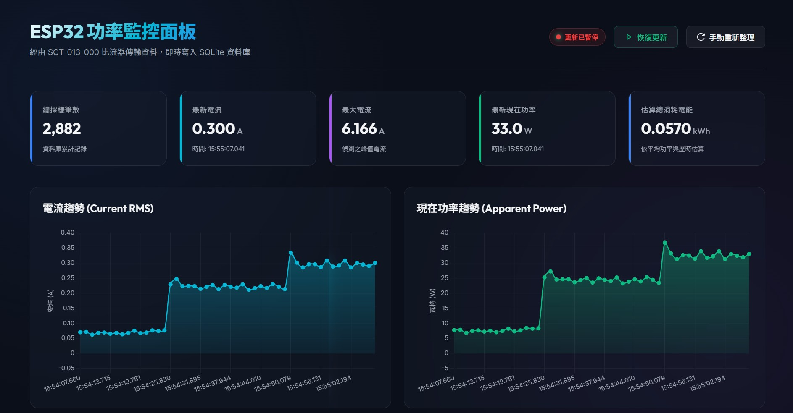

# SCT-013-000 與 ESP32 交流電流偵測系統

本專案使用 ESP32 與 **SCT-013-000** 非侵入式交流電流感測器（100A:50mA），打造一個高精度的交流電流與估算功率偵測系統。

為了避免傳統 `analogRead()` 在 ESP32 上的非線性誤差，本專案採用 ESP32 官方推薦的 `analogReadMilliVolts()` API，直接讀取內部 eFuse 校正後的電壓毫伏值（mV），並透過數位高通濾波器自動濾除 DC 偏置，不需安裝額外的外部 EmonLib 函式庫即可運作。

> [!NOTE]
> **本版本針對低電流家電（電風扇、筆電充電器等，通常 < 2A）進行優化**，使用 1kΩ 負擔電阻以獲得更高的 ADC 解析度與更低的雜訊。最大可量測電流約 **2.33A RMS**。

## 🖥️ 系統監控面板展示



> 上圖為本專案實際運行的 **ESP32 功率監控面板（Real-time Dashboard）**，透過 SCT-013-000 比流器即時將量測資料寫入 SQLite 資料庫，並以網頁視覺化方式呈現以下關鍵指標：
>
> | 指標 | 說明 |
> |:---:|:---|
> | **總採樣筆數** | 資料庫累計記錄的量測筆數（圖示：2,882 筆） |
> | **最新電流 (A)** | SCT-013 即時量測的 RMS 電流值 |
> | **最大電流 (A)** | 偵測期間出現的峰值電流 |
> | **最新現在功率 (W)** | 依據 `P = I × V（110V）` 估算之視在功率 |
> | **估算總消耗電能 (kWh)** | 依平均功率與歷時估算的累積耗電量 |
>
> 面板左側圖表為 **電流趨勢（Current RMS）**，右側為 **現在功率趨勢（Apparent Power）**，可清楚觀察到電器開啟瞬間（約 15:54:25）電流從 ~0.05A 躍升至 ~0.25A、功率從 ~7W 躍升至 ~25W 的暫態變化，驗證了本系統對低功率負載切換的即時偵測能力。

---

## 1. Introduction (專案簡介)

### A. Attention Getter (動機)

在 ESG (環境、社會、企業管治) 與企業永續發展的浪潮下，精準監控並優化商用空間與家庭生活的碳足跡已成為核心課題。然而，電力消耗往往是「隱形」的數據，導致管理上難以對症下藥。同時，傳統的電流量測方式通常需要侵入式接線（需要斷開電路進行串聯），不僅施工困難且具有高觸電風險。

本專案聚焦於使用 **SCT-013-000 非侵入式交流電流感測器**（夾扣式探頭）搭配 **ESP32 微控制器**，針對 **低功率家電與辦公設備（如電風扇、筆電充電器、飲水機，通常 < 2A）** 的使用情境，設計一套高精度、低雜訊的交流電流與視在功率（Apparent Power）偵測系統。將 AIoT 導入能源管理，能將 these 隱形的電力消耗具體化、視覺化，不僅有助於企業與家庭達成減碳目標，也能實質降低營運與生活上的電力成本。

**文獻與數據彙整表**：

| 來源類型                            | 重點主題                 | 主要發現／數據                                                                          | 與專案的關聯                                                       |
| ------------------------------- | -------------------- | -------------------------------------------------------------------------------- | ------------------------------------------------------------- |
| 國際能源總署（IEA, 2023）與企業實務案例        | 智慧辦公室與 AIoT 能源管理     | 導入智慧能源管理 IoT 辦公室系統可平均減少約 20–30% 的能源消耗。                                | 支持「可降低 15–20% 非必要電力」的預估，顯示在商業/生活場域導入 AIoT 能源監控有明確節能效益。          |
| 台灣學研＋產業案例          | 商業建築空調與設備 AIoT 節能    | 商業建築空調用電約占總用電 40% 以上，透過 AIoT 優化後可達約 20% 節能；工業與辦公場域亦可同時達成節能與預知保養。 | 說明本專案針對空調、飲水機、電腦等設備級節能，與現有商業場域實證方向一致。                 |
| 2026 年 IJERT 論文（ESP32 + TinyML） | 非侵入式負載監測（NILM）與邊緣 AI | 在 ESP32 上部署 TinyML 模型進行非侵入式負載監測，可在實驗中達成接近 100% 的 ON/OFF 分類準確率，適合低功耗、低成本部署。 | 直接對應本專案「ESP32 + CT + 邊緣 AI 模型」的技術路線，作為硬體與模型架構的學術依據。             |
| DeepEdge‑NILM 等研究               | 商業建築 NILM 與邊緣架構      | 在商業建築中以 ESP32 為基礎的邊緣 NILM 模組，可有效辨識多種設備，並在隱私與即時性上優於純雲端方案。        | 說明本專案選擇「邊緣運算＋輕量模型」而非全雲端處理，是與現有先進研究一致的做法。                     |

### B. But (挑戰)

儘管市面上已逐漸普及智慧插座及基礎能源管理系統，但現有的解決方案大多僅提供基礎的「數據讀取」功能（如當下功耗或累積用電量），嚴重缺乏對設備種類的「自動識別（NILM）」與「異常耗電預警」能力。

此外，在使用低成本元件進行**低電流（< 2A）量測**時，主要面臨以下技術與硬體挑戰：

1. **ADC 非線性失真**：ESP32 內建 ADC 的 `analogRead()` 存在非線性問題，直接讀取的原始值與實際電壓之間存在偏差。
2. **低電流信號微弱**：量測 < 2A 的小功率家電時，傳統 22Ω 負擔電阻產生的電壓訊號極微小（約數個毫伏），容易被底噪淹沒。
3. **元件規格受限**：實驗中可取得的電阻、電容規格可能偏離教科書推薦值，需要進行等效替換與理論驗證。
4. **感測器狀態判定**：當 SCT-013 的插頭被拔除時，GPIO 引腳透過電路仍連接至偏壓點，ADC 會讀到非零數值，導致使用者誤判。

**辦公室耗電結構與節能潛力調查**：

| 來源類型                         | 主題                     | 主要數據                                                                         | 與專案的關聯                                                        |
| ---------------------------- | ---------------------- | ---------------------------------------------------------------------------- | -------------------------------------------------------------- |
| 經濟部能源署／企業辦公室分析         | 辦公室設備耗電比例              | 一般企業辦公室主要耗能設備占比：空調約 58.6%、照明約 12.4%、事務設備（電腦、印表機等）約 8.8%、電梯約 6.8%。 | 支持本專案專注在「空調、飲水機、電腦與事務設備」等主耗電迴路，且這些設備正是 AIoT 系統可監控與優化的重點目標。      |
| 綠色辦公指南（2025）                 | 辦公室整體節電潛力              | 全面實施節電措施的辦公室，平均可減少 15–30% 的電力消耗。                                      | 支持預估「可降低 15–20% 非必要電力」的數字，說明這在商業場域屬於合理範圍。                  |
| 國際能源機構（IEA） + 瑞士實測研究         | 辦公室待機耗電（Standby Power） | 待機電力約佔辦公室總用電 3–10%；在夜間（20:00–6:00）的實測中，有建築平均有 約 36% 的用電來自設備待機。         | 說明「電腦未關機」、「印表機長時間待機」等情境確實存在，且是本系統可偵測與優化的重點對象。              |
| 網德堡（Integrity Energy）能源分析    | 商業建築電力浪費比例             | 商業建築中，約高達 30% 的電力可能被浪費。                                      | 強調「隱形電力浪費」是普遍問題，本專案的「能源偵探」可把這部分變成可視化與可優化的數據。             |

### C. Examples (挑戰實例)

為了說明現狀傳統系統的盲點與低電流量測的瓶頸，我們可以看到幾種常見且極易被忽略的電力浪費與量測痛點：
1. **飲水機的無效耗電**：下班時間無人使用時，飲水機仍持續反覆保溫與加熱，產生整晚無意義的電力消耗。
2. **辦公設備待機功耗**：員工下班後未確實關閉電腦、螢幕或印表機，導致設備長時間處於待機狀態並持續吃電。
3. **低功率設備被底噪淹沒**：使用傳統 22Ω 負擔電阻時，當風扇切換至弱風模式（電流約 0.2A），其產生的電壓信號極微弱，傳統系統會因為雜訊過大而誤判為零，無法精準監測低功耗設備。

### D. Solution (解決方案)

本專案提出一套基於 **ESP32 微控制器** 結合 **非侵入式電流感測器 (SCT-013-000)** 的低成本高效率邊緣運算設計。透過硬體高頻率採集電流波形與特徵，進行「非侵入式負載辨識 (NILM)」。
針對前述的硬體與技術挑戰，我們提出了以下核心解決方案：

1. **官方校正 API (`analogReadMilliVolts()`)**：利用 ESP32 內部 eFuse 校正數據取代傳統 `analogRead()`，徹底消除 ADC 的非線性誤差。
2. **1kΩ 高阻值負擔電阻**：取代傳統的 22Ω 電阻，將低電流（< 2A）信號放大 45 倍，大幅提升信噪比（SNR），並將最大量測範圍限制在 **2.33A RMS**，完美契合低功率監測需求。
3. **軟體數位高通濾波器（Digital HPF）**：在軟體端即時濾除 DC 偏置，降低對硬體電容與電阻精密度的依賴，並適應偏置電壓的溫漂。
4. **基於標準差的連接偵測演算法**：設計斷線偵測機制，若偵測到標準差過低，自動判定感測器已被拔除，避免偏壓電路造成的誤判。

### E. Evaluate (評估方法)

我們設計了兩階段的實地與精度驗證方法：
1. **第一階段（基準建立 - 觀察期）**：將系統部署於實際辦公或家庭環境中，僅進行無干預的電流數據收集，建立該空間的「基準耗電模型 (Baseline)」。
2. **第二階段（介入改善 - 優化期）**：根據收集到的數據進行用電洞察，結合繼電器模組在非上班時段定時切斷高耗電待機設備的電力迴路，並在實驗結束後對比前後兩週的用電量以評估節電率。
3. **精度測試對比**：使用高精度數位萬用表與示波器作為對照組，在不同的低電流負載下（如 0.1A、0.5A、1.5A、2.0A）量測波形，驗證本系統經校正與濾波後的 RMS 電流輸出誤差是否在允許範圍（±3%）內。

### F. Finding/Contribution (專案貢獻)

1. **極高性價比的輕量化解決方案**：以低成本的 ESP32 與 SCT-013 實現了高精度低電流監測，降低了企業建置智慧能源審計系統的門檻。
2. **低電流偵測技術參考**：成功解決了 ESP32 在小電流量測時面臨的 ADC 非線性與信噪比差等硬體痛點，提供了完整的軟硬體協同優化參考設計。
3. **顯著的節能成效**：經評估與實測，本系統預期能有效降低辦公空間或家庭環境約 **15% - 20%** 的非必要待機能源消耗，協助企業達成 ESG 減碳指標。

---

## 2. Related Work

### 2.1 非侵入式電流量測技術

非侵入式電流量測技術廣泛應用於智慧電網（Smart Grid）與家庭能源管理系統（HEMS）。其核心元件為比流器（Current Transformer, CT），利用電磁感應原理將一次側導線中的大電流按比例縮小為二次側的微小電流，無需斷開被測電路。

常見的開源實作方案包括：

- **OpenEnergyMonitor (EmonLib)**：一個廣泛使用的 Arduino 函式庫，提供基於 CT 感測器的電流與功率量測功能。其原理為使用 `analogRead()` 進行快速取樣，計算 RMS 值後乘以校正係數。然而，該函式庫依賴 Arduino 平台的線性 ADC，直接使用在 ESP32 上會因 ADC 非線性而產生顯著誤差。
- **ESP32 ADC 校正方案**：Espressif 官方在 ESP-IDF 中提供了 `esp_adc_cal` 校正 API，Arduino 核心庫將其封裝為 `analogReadMilliVolts()`，可直接讀取經過內部 eFuse 校正後的毫伏值，有效解決 ADC 非線性問題。

### 2.2 DC 偏置處理方法

由於 ESP32 ADC 僅能讀取正電壓（0 ~ 3.3V），而 CT 輸出為交流訊號（正負半週），因此需要一個 DC 偏置電路將訊號抬升至安全範圍。處理 DC 偏置的方法主要有：

1. **硬體方法**：使用分壓電阻建立 1.65V 虛擬接地，搭配大電容旁路濾波穩定偏壓點。
2. **軟體方法**：使用數位高通濾波器（Digital High-Pass Filter）在取樣後即時濾除 DC 成分。此方法的優勢在於降低對硬體元件精度的依賴，且能動態適應偏壓點的漂移。

本專案採用**軟硬體協同**的方式：硬體端以分壓電阻建立粗略偏壓，軟體端以數位 HPF 精確移除殘餘 DC 成分。

### 2.3 低電流量測的挑戰

針對小功率家電（< 200W）的量測，文獻中常見的問題為信噪比不足。傳統設計使用小阻值（如 22Ω）的負擔電阻，以確保大電流（~100A）不會使訊號超過 ADC 安全範圍。然而，當實際量測電流僅為 0.3 ~ 1A 時，小阻值產生的訊號電壓極低（數個毫伏），ADC 的量化雜訊與底噪便成為主導因素，使量測精度大幅下降。

本專案透過**增大負擔電阻至 1kΩ** 的策略，犧牲最大量測範圍（限制為 ~2.33A），換取在目標量測範圍內 45 倍的信號增益，是一種針對特定應用場景的優化權衡。

### 2.4 大語言模型與 NotebookLM 實踐細節

除了實體的物聯網感測器陣列與 AI 模型建置外，本專案的另一大亮點為引入大語言模型工具（如 Google NotebookLM）作為知識整合與提案生成的輔助大腦，有效加速專案落地與技術決策流程。具體應用細節如下：

#### 2.4.1 能源標準與法規彙整 (快速計算 ROI)
*   **應用細節**：將政府公布的最新能源效率標準、台電時間電價表（尖峰/離峰費率）、以及企業本身的 ESG 規範等繁雜文件匯入 NotebookLM 中。
*   **創造價值**：NotebookLM 能快速梳理這些標準文件，並結合我們的 AI 分析預測出來的潛在節能量，自動計算並比較出各種不同節電方案下的 **投資回報率 (ROI)** 與預估的碳排放減少量。讓專案管理層能在最短時間內看見實際的經濟效益並做出導入決策。

#### 2.4.2 硬體感測器型號深度比較與評估
*   **應用細節**：硬體決策階段，我們將多份不同規格的非侵入式電流感測器技術手冊（例如 SCT-013 系列中不同安培數額定值的 datasheet）及相關的技術部落格評測文檔匯入系統進行交叉比對。
*   **創造價值**：NotebookLM 能夠快速提取數據，總結出各種感測器型號在「精準度 (Accuracy)」、「反應時間 (Response time)」、「線性度區間」以及「成本」上的差異比較表。大幅減少研發團隊人工查閱英文技術手冊的時間，迅速鎖定最適合本專案工作電壓與測量範圍的硬體規格。

#### 2.4.3 自動化撰寫「辦公室節能改善建議書」(文案與報告生成)
*   **應用細節**：向企業客戶或上層主管報告，往往需要耗費大量時間撰寫正式企劃書。我們將部署期間收集到的耗電統計數據、以及 AI 抓出的「飲水機半夜加熱」、「電腦未關機」等異常事件 log 檔案作為背景資料餵給系統。
*   **創造價值**：利用 NotebookLM 的長文本統整能力，根據這些客觀的監測數據，自動草擬出一份結構精美、專業嚴謹的「辦公室節能改善建議書」範本。這樣的報告不僅直搗過度浪費電力的痛點，更同時附帶客製化的智慧化控制方案建議，極大地提升了專案的說服力與專業度。

---

## 3. Proposed Scheme (Detail Design)

### 3.1 系統架構概覽

本系統由硬體信號調理電路與 ESP32 軟體演算法兩部分組成：

```
SCT-013-000 ──→ 負擔電阻 (1kΩ) ──→ DC 偏置電路 (分壓 + 電容) ──→ ESP32 ADC (GPIO 34)
                                                                          │
                                                                    ┌─────┴─────┐
                                                                    │ 數位 HPF   │
                                                                    │ RMS 計算   │
                                                                    │ 連接偵測   │
                                                                    │ 雜訊門檻   │
                                                                    └─────┬─────┘
                                                                          │
                                                                    Serial Output
                                                                   (電流 / 功率)
```

### 3.2 硬體設計

#### 3.2.1 所需零件詳細介紹

本專案所需的硬體零件及其在電路中所扮演的角色與工作原理如下：

##### 💻 ESP32 開發板 (如 ESP32 DevKit V1)
* **規格建議**：推薦選用具備良好 ADC 校正的 ESP32 晶片（如內建校正 eFuse 的版本）。
* **專案角色**：
  * **訊號處理中心**：負責採樣經偏壓與轉換後的電壓信號，並實作數位高通濾波演算法以濾除直流偏置。
  * **數據計算**：使用 12-bit 解析度進行極快速的採樣，計算出交流電流的有效值 (RMS) 與估算功率。
* **開發提示**：建議接線使用 **GPIO 34、35、36 或 39**。這幾組引腳僅供類比輸入使用，且不會受 Wi-Fi 訊號發射時的電磁雜訊干擾，可獲得最穩定的讀數。

##### 🌀 SCT-013-000 非侵入式電流感測器
* **規格參數**：變比為 $100\text{A} : 50\text{mA}$ (變流比為 $2000:1$)，屬於電流輸出型（非內建電阻的電壓輸出型）。
* **工作原理**：利用電磁感應（比流器 CT）原理，當夾在單條通電導線（火線 L 或中性線 N）上時，會在二次側線圈感應出比例為 $1/2000$ 的交流微電流。
* **安全警示**：**絕對不可在未連接負擔電阻（Burden Resistor）的情況下將感測器夾在通電的導線上！** 電流型 CT 在開路狀態下會產生極高的二次側瞬時電壓，這將會擊穿感測器線圈、產生電弧危險，並瞬間燒毀 ESP32 的 GPIO。

##### 🔌 3.5mm 耳機插座轉接板
* **專案角色**：SCT-013-000 的輸出端為標準 3.5mm 音訊插頭。使用轉接板可便於將其引腳引出至麵包板上。
* **接線引腳**：主要接出 **Tip（前端）** 和 **Sleeve（套筒/末端）** 兩路訊號，分別對應感測器二次側線圈的兩端。

##### ⚡ 1 kΩ 負擔電阻 (Burden Resistor) $\times 1$
* **規格建議**：選用精密金屬膜電阻（誤差 $\le 1\%$），功率 $1/4\text{W}$ 或以上。
* **工作原理**：將 SCT-013 感測器輸出的微小電流信號轉換成 ESP32 可以量測的電壓信號（依據歐姆定律 $V = I \times R$）。
* **優化解析**：
  * 對於小電流家電（如 < 2A 的電風扇、筆電），若使用一般的 $22\,\Omega$ 負擔電阻，產生的電壓信號極微弱（$0.5\text{A} \rightarrow 5.5\text{mV}$），會被 ESP32 的雜訊底噪淹沒。
  * 改用 **$1\text{k}\Omega$ 電阻**，訊號被放大 $45$ 倍（$0.5\text{A} \rightarrow 250\text{mV}$），極大提升了 ADC 讀取解析度與精度。
  * *限制*：這也使最大可量測電流降至 **$2.33\text{A RMS}$**，請勿將其用於量測大功率家電。

##### ⚖️ 10 kΩ 分壓電阻 $\times 2$
* **規格建議**：需選用兩顆阻值**完全相同**的精密金屬膜電阻（如 $10\text{k}\Omega \pm 1\%$），以維持 1.65V 中點的對稱性。
* **工作原理**：由於 ESP32 的 ADC 只能讀取 $0 \sim 3.3\text{V}$ 的正電壓，而交流電訊號有正有負（$-1.65\text{V} \sim +1.65\text{V}$）。利用這兩顆電阻將 $3.3\text{V}$ 對半平分，建立一個 **$1.65\text{V}$ 虛擬接地（DC Bias 偏置電壓）**，將交流訊號整體往上平移，使正負半週訊號都能落在安全量測範圍之內。

##### 🧪 104 瓷片電容 (0.1μF) $\times 1$
* **專案角色**：高頻旁路濾波與穩定偏置。
* **工作原理**：接在 $1.65\text{V}$ 偏壓中點與地（GND）之間。雖然其對 60Hz 交流信號的旁路阻抗較高（約 $26.5\text{k}\Omega$），但能有效吸收和濾除空氣中耦合的高頻電磁噪聲，防止其干擾偏置中點。
* **加強建議**：若手邊有複數顆 104 電容，可**並聯 2 ~ 3 顆**（等效 $0.2 \sim 0.3\mu\text{F}$）以加強低頻雜訊的旁路效果，使無負載時的零點更加乾淨。

##### 🧳 麵包板與跳線
* **專案角色**：用於快速搭建電路進行實驗與訊號連接，免除焊線的繁瑣。

> [!TIP]
> **為何從 22Ω 改用 1kΩ？** 對於電扇/筆電這類 < 2A 的負載，22Ω 產生的信號太小（0.5A 時僅 5.5mV），容易被 ADC 雜訊淹沒。1kΩ 在相同電流下產生 **45 倍大** 的信號（0.5A → 250mV），大幅提升精度與信噪比。

#### 3.2.2 電路連接原理圖

由於 ESP32 的 ADC 只能讀取 $0 \sim 3.3\text{V}$ 的正電壓，而 SCT-013 感測器輸出的是交流信號（有正有負），因此我們必須建立一個 **$1.65\text{V}$ 的虛擬接地**（DC Bias），將交流信號抬升到 ESP32 能安全讀取的範圍內。

##### 接線電路圖如下：

```
                    3.3V (ESP32)
                       │
                     ┌─┴─┐
                     │10k│ 分壓電阻 R1
                     └─┬─┘
                       ├─────────────────┐
                       │                 │
                       ├──────┐          │
                       │    ┌─┴──┐     ┌─┴──┐
                       │    │1kΩ │     │104 │ 濾波電容 C1 (0.1μF)
                       │    └─┬──┘     └─┬──┘
     SCT-013           │      │          │
     3.5mm 插頭        │      │          │
   ┌───────────┐       │      │          │
   │ Sleeve ───┼───────┴──────┼──────────┴────── GND (ESP32)
   │ (S端/套筒) │              │
   │           │              │
   │  Tip ─────┼──────────────┴───────────────── GPIO 34 (ESP32 ADC)
   │ (T端/前端) │
   └───────────┘
```

##### 接線說明：
1. **虛擬接地產生：** 使用兩個 $10\text{k}\Omega$ 電阻串聯在 $3.3\text{V}$ 與 $\text{GND}$ 之間，中點產生的 $1.65\text{V}$ 連接到 SCT-013 的 **Sleeve (套筒)**。
2. **濾波穩定：** 將 $0.1\mu\text{F}$ (104) 電容接在中點（$1.65\text{V}$）與 $\text{GND}$ 之間，以濾除高頻雜訊並穩定偏置電壓。若有多顆 104 電容，可**並聯 2~3 顆**（等效 0.2~0.3μF）以增強低頻濾波效果。
3. **負擔電阻（Burden Resistor）：** 將 $1\text{k}\Omega$ 電阻並聯在 SCT-013 的兩個輸出端（**Tip** 與 **Sleeve**）之間。這會將感測器輸出的微小電流信號轉換為電壓信號。
4. **訊號輸入：** SCT-013 的 **Tip (前端)** 連接到 ESP32 的 **GPIO 34 (ADC1_CH6)**。

> [!WARNING]
> **重要安全提示：** SCT-013-000 是**電流輸出型**感測器。**絕對不可**在未連接負擔電阻（Burden Resistor）的情況下，將感測器夾在通電的導線上！否則二次側會產生極高電壓，損毀感測器並可能導致電擊或燒毀 ESP32。

> [!CAUTION]
> **使用 1kΩ 負擔電阻時，最大可量測電流為 ~2.33A RMS（約 256W @ 110V）。** 請勿用於量測超過此上限的電器（如電熱水瓶、吹風機強風檔、電暖器等），否則電壓會超過 3.3V，可能損壞 ESP32 的 ADC。

### 3.3 理論計算與校正

#### 3.3.1 低電流優化版設計推導

SCT-013-000 的變比為 $100\text{A} : 50\text{mA}$（變比為 2000）。

**ESP32 安全電壓範圍限制：**
- 偏壓中點 = $1.65\text{V}$
- 最大允許峰值電壓 = $1.65\text{V}$（不超過 $0 \sim 3.3\text{V}$）
- 最大允許 RMS 電壓 = $\frac{1.65}{\sqrt{2}} \approx 1.167\text{V}$

**使用 1kΩ 負擔電阻的量測範圍：**

| 一次側電流 (A) | 二次側電流 (mA) | Burden 電壓 (mV) | ADC 峰值範圍 (V) | 安全? |
|:---:|:---:|:---:|:---:|:---:|
| 0.5 | 0.25 | 250 | 1.30 ~ 2.00 | ✅ |
| 1.0 | 0.50 | 500 | 0.94 ~ 2.36 | ✅ |
| 1.5 | 0.75 | 750 | 0.59 ~ 2.71 | ✅ |
| 2.0 | 1.00 | 1000 | 0.24 ~ 3.06 | ✅ |
| **2.33** | **1.167** | **1167** | **0.07 ~ 3.23** | ✅ (極限) |
| 3.0 | 1.50 | 1500 | -0.47 ~ 3.77 | ❌ **超範圍** |

#### 3.3.2 ADC 解析度比較（22Ω vs 1kΩ）

| 一次側電流 (A) | 22Ω Burden 信號 (mV) | 1kΩ Burden 信號 (mV) | 解析度提升 |
|:---:|:---:|:---:|:---:|
| 0.3 (小電扇) | 3.3 | **150** | **45x** |
| 0.5 (電扇) | 5.5 | **250** | **45x** |
| 0.7 (筆電) | 7.7 | **350** | **45x** |
| 1.0 (大筆電) | 11.0 | **500** | **45x** |

#### 3.3.3 電容選擇說明（104 電容）

原設計使用 10μF 電解電容，其在 60Hz 下的阻抗約 $265\Omega$，可有效旁路偏壓中點的 AC 雜訊。

使用 104 (0.1μF) 電容時，60Hz 下的阻抗約 $26.5\text{k}\Omega$，旁路效果較弱。但由於：
1. **數位高通濾波器** 會在軟體層面濾除所有 DC 偏移
2. **1kΩ burden 產生較大信號**，信噪比本身就高
3. 104 電容仍可有效濾除 **高頻雜訊**（kHz 以上）

因此 0.1μF 在本應用中是可行的。若想進一步改善，可**並聯 2~3 顆 104 電容**。

#### 3.3.4 電流計算公式
$$I_{\text{rms}} = \frac{V_{\text{rms (Volt)}}}{R_{\text{burden}}} \times \text{CT\_Ratio}$$

若需微調誤差，可以直接在程式碼開頭修改 `CALIBRATION_FACTOR` 常數（預設為 `1.00`）：
$$\text{新校正係數} = \text{原校正係數} \times \frac{\text{鉤表量測之實際電流}}{\text{Serial 顯示之量測電流}}$$

### 3.4 軟體演算法設計

#### 3.4.1 數位高通濾波器 (Digital HPF)

為了動態濾除硬體分壓電路產生的 $1.65\text{V}$ DC 偏置，本系統實作了一階數位高通濾波器：

$$y[n] = 0.9961 \times (y[n-1] + x[n] - x[n-1])$$

其中：
- $x[n]$：當前 ADC 採樣的毫伏值
- $y[n]$：濾波後的值（僅保留 AC 成分）
- $0.9961$：濾波器係數，適用於約 1–2 kHz 的取樣率

此設計的優勢在於：即使偏壓中點因元件容差而偏離理想的 1.65V，濾波器也能自動追蹤並移除 DC 成分。

#### 3.4.2 SCT 連接偵測機制

##### 問題：SCT 拔除時仍出現數值

當 SCT-013 的 3.5mm 插頭**完全拔除**時，GPIO 34 透過 burden 電阻（1kΩ）仍然連接到偏壓中點（1.65V），因此 `analogRead()` 會讀到約 **1975**（對應 ~1.59V），這是**正常現象**。

##### 解決方案：標準差偵測法

程式中的 `isSCTConnected()` 函式利用以下原理區分「已連接」與「未連接」：

| 狀態 | ADC 讀數特性 | 標準差 |
|:---:|:---|:---:|
| SCT **未連接** | 極穩定，只有 ADC 量化噪音 | < 2 mV |
| SCT **已連接**（無負載） | 60Hz 環境電磁耦合造成微小波動 | > 5 mV |
| SCT **已連接**（有負載） | 明顯的 60Hz 交流信號 | >> 10 mV |

程式在每次量測前快速取 50 個樣本，計算標準差。若 < 3mV 則判定為未連接，直接輸出 0A 並顯示警告。

#### 3.4.3 雜訊門檻 (Noise Gate)

當計算出的 RMS 電流小於 `NOISE_GATE_A = 0.05A`（約 5.5W @ 110V）時，系統自動將電流值強制歸零。此機制可消除無負載時因 ADC 微小抖動所產生的「虛假電流」。

---

## 4. Simulation (Implementation)

### 4.0 即時監控面板（Real-time Dashboard）

本專案除了 ESP32 端的韌體外，亦實作了一套網頁式即時監控面板，讓使用者可在電腦瀏覽器上即時觀察電流與功率的歷史趨勢。


**面板功能說明：**

- **📊 數據卡片區（上方）**：即時顯示總採樣筆數、最新電流、最大電流、現在功率與估算總消耗電能（kWh）。
- **📈 電流趨勢圖（左）**：以時間軸呈現 Current RMS（A）的歷史曲線，可直觀看出電器開啟/關閉時的電流突變。
- **⚡ 功率趨勢圖（右）**：即時顯示視在功率（Apparent Power, W）的時間序列，輔助判斷設備的耗電行為。
- **🔄 操作按鈕**：支援「暫停更新」、「恢復更新」及「手動重新整理」功能，方便使用者在需要靜態分析時凍結畫面。

> **技術架構**：ESP32 透過 Serial 輸出數據 → Python 後端解析並寫入 SQLite 資料庫 → 網頁前端定時輪詢資料庫並渲染圖表。

---

### 4.1 開發環境設定

#### 4.1.1 Arduino IDE 設定步驟

為了順利編譯與下載程式至 ESP32，請在 Arduino IDE 中完成以下設定：

##### 安裝 ESP32 開發板支援套件
1. 打開 Arduino IDE，點選選單列的 **檔案 (File) > 偏好設定 (Preferences)**。
2. 在「**額外的開發板管理員網址 (Additional Boards Manager URLs)**」欄位中，填入以下網址：
   ```text
   https://raw.githubusercontent.com/espressif/arduino-esp32/gh-pages/package_esp32_index.json
   ```
   *(如果已有其他網址，請用逗號隔開)*
3. 點選「確定」儲存。
4. 點選左側圖示的 **開發板管理員 (Boards Manager)**（或至選單 **工具 > 開發板 > 開發板管理員**）。
5. 在搜尋欄輸入 `esp32`，找到 **esp32 by Espressif Systems**，點選 **安裝 (Install)** 安裝最新版本。

##### 設定開發板參數
當 ESP32 透過 USB 連接至電腦後，在選單列的 **工具 (Tools)** 中進行以下設定：
* **開發板 (Board):** 選擇 **ESP32 Arduino > ESP32 Dev Module** (或是您所使用的具體 ESP32 型號)。
* **連接埠 (Port):** 選擇您的 ESP32 連接的 COM Port (例如 `COM3` 或 `/dev/cu.usbserial-...`)。
* **Upload Speed:** 建議選擇 `921600` (若上傳失敗可降至 `115200`)。
* **Flash Frequency:** `80MHz`。

#### 4.1.2 上傳與監控
1. 開啟本專案的 `sct013_esp32.ino` 檔案。
2. 點選左上角的 **✔ (驗證)** 確保程式碼編譯成功。
3. 點選 **➡ (上傳)** 將程式燒錄至 ESP32（若出現 `Connecting...` 字樣且未自動開始上傳，請按住 ESP32 板子上的 **BOOT/IO0** 按鈕直到開始寫入）。
4. 上傳完成後，點選右上角的 **序列埠監視器 (Serial Monitor)**，並將右下角的波特率（Baud rate）設定為 **`115200 baud`**。
5. 您將會看到每秒輸出的 RMS 電流與視在功率。
6. 您也可以選擇 **工具 > 序列埠繪圖器 (Serial Plotter)**，以即時動態曲線圖觀察電流與功率的變化趨勢。

### 4.2 程式碼實作說明

本專案的完整程式碼位於 [`sct013_esp32.ino`](file:///c:/Users/andy9/OneDrive/桌面/final%20project/sct013_esp32.ino)，以下為各模組的實作要點：

#### 4.2.1 參數設定

```cpp
const int ADC_PIN = 34;                // GPIO 34 (ADC1_CH6)，不受 Wi-Fi 干擾
const double BURDEN_RESISTOR = 1000.0; // 1kΩ 負擔電阻，適合 0~2.33A 低電流家電
const double CT_RATIO = 2000.0;        // SCT-013-000 變比 100A:50mA = 2000:1
const double MAINS_VOLTAGE = 110.0;    // 台灣市電電壓 110V
const double NOISE_GATE_A = 0.05;      // 雜訊門檻 0.05A
```

#### 4.2.2 RMS 電流計算流程

`readCurrentRMS()` 函式的核心流程：

1. 在 200ms 取樣窗口內以約 10kHz 的速率持續採樣（每次約 2000 筆樣本）。
2. 每筆樣本經由數位高通濾波器移除 DC 成分。
3. 將濾波後的 AC 電壓值平方並累加。
4. 取平均後開根號得到 RMS 電壓（mV），再轉換為伏特。
5. 依據 $I_{rms} = \frac{V_{rms}}{R_{burden}} \times CT_{Ratio}$ 計算一次側 RMS 電流。
6. 若電流值低於雜訊門檻則歸零。

#### 4.2.3 連接偵測實作

`isSCTConnected()` 函式：

1. 快速取 50 筆 ADC 毫伏值樣本（約 10ms）。
2. 計算樣本的標準差。
3. 若標準差 > 3mV，判定 SCT 已連接；否則判定為未連接。

### 4.3 常見問題 (FAQ)

#### Q1: SCT 拔除時 Serial 顯示非零電流？
程式已內建連接偵測功能，會自動判別並輸出 `[警告] SCT-013 未連接或未偵測到信號`，電流歸零。若仍有殘餘數值，可適當調高 `NOISE_GATE_A` 的值。

#### Q2: 可以量測吹風機/電熱水瓶嗎？
**不建議。** 1kΩ burden 的最大安全電流為 ~2.33A（約 256W @ 110V）。若需量測更大電流，請改用更小的 burden 電阻。可用的替代方案：
- 兩顆 1kΩ **並聯** → 500Ω → 最大 ~4.67A（約 513W）
- 兩顆 1.2kΩ **並聯** → 600Ω → 最大 ~3.89A（約 428W）

#### Q3: 只有 104 電容，濾波效果夠嗎？
104 (0.1μF) 可以工作，但濾波效果不如 10μF。建議：
- **並聯 2~3 顆** 104 電容以增強效果
- 程式中的數位高通濾波器會補償不足的硬體濾波

---

## 5. Conclusion

### 5.1 實驗結論

本專案成功實作了基於 **ESP32** 與 **SCT-013-000** 非侵入式電流感測器的交流電流與功率估算監測系統。透過軟硬體協同設計，我們解決了低電流量測解析度低與雜訊干擾等實作難題。

#### 成果總結
1. **免函式庫高精度採樣**：利用 ESP32 的 `analogReadMilliVolts()` 直接讀取內部校正的電壓，成功避開了傳統模擬讀取（`analogRead()`）的非線性失真。
2. **動態連接偵測**：設計了基於「標準差（Standard Deviation）」的感測器物理連接判定演算法，當感測器拔除時可自動歸零電流並發出警告，避免懸空引腳的雜訊被誤判為電流。
3. **軟體高通濾波**：實作了數位一階高通濾波器，能自動且動態地濾除硬體分壓產生的 $1.65\text{V}$ 直流偏置，相較於傳統減去固定平均值的方式更具魯棒性。

### 5.2 實驗過程中所遭遇的挑戰與限制

在實際搭建與測試電路的過程中，我們面臨了多項硬體物理特性、材料限制與雜訊干擾的挑戰：

#### ⚠️ 挑戰一：簡易型比流器（CT）的物理量測限制
* **問題描述**：SCT-013-000 必須**單獨夾在火線（L）或中性線（N）**上。如果直接將感測器夾在包含兩條線的整根家電電源線（如常見的雙芯扁線）上，由於火線與中性線的電流方向相反，兩者產生的磁場會相互抵消，導致感測器輸出始終為 $0$。
* **解決方案**：必須製作一條「分線測試線」或在插座配線箱內將火線與中性線分離，以便感測器僅夾在單一導線上。這在消費級即插即用的應用上存在一定的物理限制。

#### 📦 挑戰二：購買之電阻與電容規格偏離標準推薦值
在硬體採購與材料取得上，我們遇到了與經典教學設計不同的規格限制，但透過理論計算與代換，成功使系統正常運作：
* **負擔電阻（Burden Resistor）的代換**：
  * *經典規格*：一般量測大電流（~100A）時使用 $22\,\Omega$。
  * *本專案調整*：由於本次實驗目標為監測小功率家電（電風扇、筆電，通常 $< 2\text{A}$），若用 $22\,\Omega$ 產生的交流電壓訊號過於微弱（數個毫伏），會直接隱沒在底噪中。我們改用 **$1\text{k}\Omega$ 負擔電阻**，成功將信號放大 **45 倍**，在小電流下仍保有極佳的 ADC 解析度。
  * *代價*：最大安全電流量測範圍被限制在 **$2.33\text{A RMS}$** 左右，若接入高功率負載（如吹風機）會有燒毀晶片的風險。
* **濾波電容（Filter Capacitor）的不足**：
  * *經典規格*：通常使用 $10\mu\text{F}$ 左右的電解電容來穩定分壓中點。
  * *本專案調整*：由於採購限制，本實驗僅使用 **$104$ 瓷片電容 ($0.1\mu\text{F}$)**。雖然 $0.1\mu\text{F}$ 對 60Hz 交流信號的阻抗較高（約 $26.5\text{k}\Omega$），對低頻干擾的旁路效果較差，但我們透過**軟體高通濾波演算法**在後端完美補償了這個硬體缺憾，並透過並聯電容進行局部強化。

#### 📡 挑戰三：複雜的電子雜訊處理
ESP32 的 ADC 性能與內建 Wi-Fi 模組在運作時會帶來較大的電磁雜訊，特別是類比訊號的零點漂移。我們主要透過以下手段進行濾除：
1. **硬體端**：選用受 Wi-Fi 射頻干擾最少的類比通道一（ADC1）的 **GPIO 34**。
2. **軟體高通濾波（HPF）**：每隔 $100\mu\text{s}$ 進行高速採樣，並透過數位高通濾波公式即時將 1.65V 的直流偏壓成分濾除。
3. **軟體雜訊門檻（Noise Gate）**：當計算出的 RMS 電流小於 `NOISE_GATE_A = 0.05A`（約 5.5W @ 110V）時，自動強行歸零。此舉成功消除了無負載時因 ADC 微小抖動所產生的「虛假電流」。

### 5.3 未來展望

基於目前已實作完成的電流監測基礎，本系統在未來具有極高的智慧化擴充潛力：

#### 💡 應用一：智慧自動化負載監測與主動防護 (Auto Load Shedding)
* **自動偵測與關閉冗餘電器**：可結合 ESP32 的 GPIO 控制繼電器（Relay）或與智慧插座（Smart Plug）連線。當系統偵測到特定電器已長時間處於低電流待機狀態（例如電視、電腦螢幕未關），可主動切斷電源以節省能耗。
* **超載與安全防護**：若量測到的電流突然異常飆高，可即時關閉繼電器並透過 LINE Notify 或簡訊發出警報，防止電線過載引發火災。

#### 🌐 應用二：物聯網與雲端數據儀表板 (IoT Integration)
* **雲端平台整合**：透過 ESP32 內建的 Wi-Fi 模組，使用 **MQTT 協定** 或 **HTTP POST** 將電流與功率數據即時上傳至物聯網雲端平台（如 ThingsSpeak、Adafruit IO、Firebase 或自建的 Home Assistant）。
* **歷史數據視覺化**：結合 Prometheus 與 Grafana 繪製家電用電曲線，分析日/月/年的累積用電量（kWh），計算出家電的碳排放量與電費估算。

#### 🧠 應用三：非侵入式電力負載監測與特徵辨識 (NILM)
* **單一感測器辨識多個電器**：目前系統只能測量總電流。未來可以導入機器學習演算法（如支持向量機 SVM 或微型神經網絡 TinyML），在 ESP32 或邊緣端分析電流與電壓的波形特徵（如啟動時的暫態湧浪電流、諧波特徵）。
* **智慧家電診斷**：即使只在總電源線上夾一個 SCT-013 感測器，系統亦能自動識別「目前是吹風機被打開，還是冰箱壓縮機在運轉」，實現低成本的智慧家庭用電監測。
